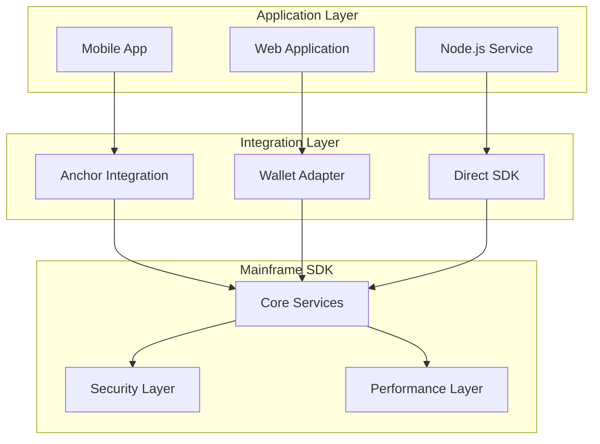

# Mainframe SDK: Integration Guide

## Overview

This guide provides detailed integration patterns for the Mainframe SDK across different frameworks, environments, and use cases. Each integration pattern is production-tested and follows best practices for security, performance, and reliability.

## Integration Architecture



## Anchor Framework Integration

### Setup

```typescript
import { AnchorProvider, Program, Wallet } from "@coral-xyz/anchor";
import { Connection, Keypair } from "@solana/web3.js";
import { 
  createAnchorMainframeSDK,
  AnchorMainframeSDK 
} from "@maikers/mainframe-sdk";

// Create Anchor provider
const connection = new Connection(
  "https://api.mainnet-beta.solana.com",
  { commitment: "confirmed" }
);

const wallet = new Wallet(Keypair.generate());

const provider = new AnchorProvider(connection, wallet, {
  commitment: "confirmed",
  preflightCommitment: "confirmed",
  skipPreflight: false
});

// Initialize Mainframe SDK with Anchor
const sdk = createAnchorMainframeSDK(provider, {
  programId: "mnfm211AwTDA8fGvPezYs3jjxAXgoucHGuTMUbjFssE",
  protocolWallet: "PROTOCOL_WALLET_PUBKEY",
  storage: {
    primary: 'arweave',
    fallback: ['ipfs']
  }
});

await sdk.initializeWithProvider(provider);
```

### Priority Fees & Compute Units

```typescript
// Create agent with custom priority fees
const result = await sdk.createAgentWithPriorityFee(
  nftMint,
  agentConfig,
  10000,   // Priority fee in micro-lamports per compute unit
  800000   // Compute unit limit
);

// Update with priority fees
await sdk.updateAgentWithPriorityFee(
  agentAccount,
  newConfig,
  5000,
  400000
);
```

### Transaction Building

```typescript
// Build transaction without sending
const tx = await sdk.buildCreateAgentTransaction(nftMint, agentConfig);

// Add additional instructions
tx.add(
  SystemProgram.transfer({
    fromPubkey: wallet.publicKey,
    toPubkey: recipientPubkey,
    lamports: 1000000
  })
);

// Sign and send
const signature = await provider.sendAndConfirm(tx);
console.log("Transaction:", signature);
```

### Program Interaction

```typescript
// Access underlying Anchor program
const program = sdk.getProgram();

// Direct program method calls
const [agentPDA] = await program.methods
  .deriveAgentPda(nftMint);

// Fetch account data
const agentAccount = await program.account.agentAccount.fetch(agentPDA);
```

## Wallet Adapter Integration

### React Setup

```typescript
import React from 'react';
import { WalletProvider, ConnectionProvider } from '@solana/wallet-adapter-react';
import { WalletModalProvider } from '@solana/wallet-adapter-react-ui';
import { PhantomWalletAdapter, SolflareWalletAdapter } from '@solana/wallet-adapter-wallets';
import { MainframeProvider, useMainframe } from '@maikers/mainframe-sdk/react';

// Wallet configuration
const wallets = [
  new PhantomWalletAdapter(),
  new SolflareWalletAdapter()
];

const endpoint = "https://api.mainnet-beta.solana.com";

// App wrapper
function App() {
  return (
    <ConnectionProvider endpoint={endpoint}>
      <WalletProvider wallets={wallets} autoConnect>
        <WalletModalProvider>
          <MainframeProvider config={{
            programId: "mnfm211AwTDA8fGvPezYs3jjxAXgoucHGuTMUbjFssE",
            protocolWallet: "PROTOCOL_WALLET_PUBKEY"
          }}>
            <AgentManager />
          </MainframeProvider>
        </WalletModalProvider>
      </WalletProvider>
    </ConnectionProvider>
  );
}
```

### React Hook Usage

```typescript
import { useMainframe } from '@maikers/mainframe-sdk/react';
import { useWallet } from '@solana/wallet-adapter-react';

function AgentManager() {
  const { connected } = useWallet();
  const { sdk, isReady, error } = useMainframe();
  const [agents, setAgents] = React.useState([]);
  
  // Load user's agents
  React.useEffect(() => {
    if (isReady && connected) {
      loadAgents();
    }
  }, [isReady, connected]);
  
  const loadAgents = async () => {
    try {
      const userAgents = await sdk.getMyAgents();
      setAgents(userAgents);
    } catch (error) {
      console.error("Failed to load agents:", error);
    }
  };
  
  const createAgent = async (nftMint, config) => {
    try {
      const result = await sdk.createAgent(nftMint, config);
      console.log("Agent created:", result.agentAccount);
      await loadAgents(); // Refresh list
    } catch (error) {
      console.error("Failed to create agent:", error);
      throw error;
    }
  };
  
  if (!connected) {
    return <div>Please connect your wallet</div>;
  }
  
  if (!isReady) {
    return <div>Loading Mainframe SDK...</div>;
  }
  
  if (error) {
    return <div>Error: {error.message}</div>;
  }
  
  return (
    <div>
      <h2>My Agents ({agents.length})</h2>
      {agents.map(agent => (
        <AgentCard key={agent.address} agent={agent} />
      ))}
      <CreateAgentButton onCreate={createAgent} />
    </div>
  );
}
```

### Direct Integration

```typescript
import { useWallet, useConnection } from '@solana/wallet-adapter-react';
import { createWalletAdapterSDK } from '@maikers/mainframe-sdk';

function useMainframeSDK() {
  const { wallet } = useWallet();
  const { connection } = useConnection();
  const [sdk, setSdk] = React.useState(null);
  
  React.useEffect(() => {
    if (wallet?.adapter && connection) {
      const mainframeSDK = createWalletAdapterSDK(
        wallet.adapter,
        connection,
        {
          programId: "mnfm211AwTDA8fGvPezYs3jjxAXgoucHGuTMUbjFssE",
          protocolWallet: "PROTOCOL_WALLET_PUBKEY"
        }
      );
      
      setSdk(mainframeSDK);
    }
  }, [wallet, connection]);
  
  return sdk;
}
```

## Direct SDK Integration

### Node.js Service

```typescript
import { Connection, Keypair, PublicKey } from '@solana/web3.js';
import { MainframeSDK } from '@maikers/mainframe-sdk';
import fs from 'fs';

// Load keypair from file
const keypairData = JSON.parse(
  fs.readFileSync('/path/to/keypair.json', 'utf-8')
);
const keypair = Keypair.fromSecretKey(new Uint8Array(keypairData));

// Initialize connection
const connection = new Connection(
  process.env.SOLANA_RPC_ENDPOINT,
  { commitment: 'confirmed' }
);

// Initialize SDK
const sdk = new MainframeSDK({
  solanaNetwork: 'mainnet-beta',
  rpcEndpoint: process.env.SOLANA_RPC_ENDPOINT,
  programId: process.env.MAINFRAME_PROGRAM_ID,
  protocolWallet: process.env.PROTOCOL_WALLET,
  
  storage: {
    primary: 'arweave',
    fallback: ['ipfs'],
    arweave: {
      gateway: 'https://arweave.net',
      bundler: 'https://node2.bundlr.network',
      wallet: JSON.parse(process.env.ARWEAVE_WALLET_JWK)
    }
  }
});

// Set wallet programmatically
sdk.wallet.setWallet({
  publicKey: keypair.publicKey,
  signTransaction: async (tx) => {
    tx.partialSign(keypair);
    return tx;
  },
  signAllTransactions: async (txs) => {
    return txs.map(tx => {
      tx.partialSign(keypair);
      return tx;
    });
  }
});

// Agent management service
class AgentManagementService {
  async createAgentForUser(userId, nftMint, config) {
    try {
      const result = await sdk.createAgent(nftMint, config);
      
      // Store in database
      await this.saveAgentToDatabase({
        userId,
        agentAccount: result.agentAccount,
        nftMint: nftMint.toString(),
        signature: result.signature,
        createdAt: new Date()
      });
      
      return result;
    } catch (error) {
      console.error(`Failed to create agent for user ${userId}:`, error);
      throw error;
    }
  }
  
  async getUserAgents(userId) {
    const dbAgents = await this.getAgentsFromDatabase(userId);
    
    // Fetch latest on-chain data
    const agents = await Promise.all(
      dbAgents.map(async (dbAgent) => {
        const onChainData = await sdk.getAgentAccount(dbAgent.agentAccount);
        return {
          ...dbAgent,
          ...onChainData,
          status: onChainData.status
        };
      })
    );
    
    return agents;
  }
}
```

### Automated Agent Management

```typescript
import { MainframeSDK } from '@maikers/mainframe-sdk';
import { EventEmitter } from 'events';

class AgentAutomation extends EventEmitter {
  private sdk: MainframeSDK;
  private monitoringInterval: NodeJS.Timer;
  
  constructor(sdk: MainframeSDK) {
    super();
    this.sdk = sdk;
  }
  
  async startMonitoring(agentAccounts: PublicKey[]) {
    // Monitor agent events
    this.sdk.events.onAgentError((event) => {
      this.handleAgentError(event);
    });
    
    // Periodic health checks
    this.monitoringInterval = setInterval(async () => {
      for (const agentAccount of agentAccounts) {
        await this.checkAgentHealth(agentAccount);
      }
    }, 60000); // Every minute
  }
  
  async checkAgentHealth(agentAccount: PublicKey) {
    try {
      const agent = await this.sdk.getAgentAccount(agentAccount);
      
      if (agent.status === 'Paused') {
        this.emit('agent:paused', { agentAccount, agent });
      }
      
      // Check agent metrics
      const metrics = await this.getAgentMetrics(agentAccount);
      if (metrics.errorRate > 0.1) {
        this.emit('agent:high-error-rate', { agentAccount, metrics });
      }
    } catch (error) {
      this.emit('agent:health-check-failed', { agentAccount, error });
    }
  }
  
  async handleAgentError(event) {
    console.error('Agent error:', event);
    
    // Automatic recovery for certain errors
    if (event.recoverable) {
      try {
        await this.sdk.resumeAgent(event.agentAccount);
        console.log('Agent automatically resumed');
      } catch (error) {
        console.error('Failed to resume agent:', error);
      }
    }
  }
  
  stopMonitoring() {
    if (this.monitoringInterval) {
      clearInterval(this.monitoringInterval);
    }
  }
}
```

## Batch Operations

### Efficient Bulk Agent Management

```typescript
import { BatchProcessor } from '@maikers/mainframe-sdk';

// Create batch processor for agent operations
const agentBatchProcessor = new BatchProcessor(
  async (operations) => {
    return await Promise.all(
      operations.map(op => sdk.getAgentAccount(op.agentAccount))
    );
  },
  50,   // Batch size
  100   // Max wait time (ms)
);

// Fetch multiple agents efficiently
const agents = await Promise.all([
  agentBatchProcessor.add({ agentAccount: agent1 }),
  agentBatchProcessor.add({ agentAccount: agent2 }),
  agentBatchProcessor.add({ agentAccount: agent3 }),
  // Automatically batched
]);

// Batch updates
async function batchUpdateAgents(updates) {
  const results = [];
  
  for (const update of updates) {
    try {
      const result = await sdk.updateAgent(
        update.agentAccount,
        update.config
      );
      results.push({ success: true, ...result });
    } catch (error) {
      results.push({ success: false, error: error.message });
    }
  }
  
  return results;
}
```

## Versioned Transactions

### Using Address Lookup Tables

```typescript
import { 
  AddressLookupTableProgram,
  TransactionMessage,
  VersionedTransaction
} from '@solana/web3.js';

// Create versioned transaction with lookup tables
async function createAgentWithLookupTable(
  sdk: MainframeSDK,
  nftMint: PublicKey,
  config: AgentConfig,
  lookupTable: PublicKey
) {
  // Get lookup table account
  const lookupTableAccount = await connection.getAddressLookupTable(lookupTable);
  
  // Build transaction
  const { transaction, signers } = await sdk.buildCreateAgentTransaction(
    nftMint,
    config
  );
  
  // Convert to versioned transaction
  const messageV0 = new TransactionMessage({
    payerKey: sdk.wallet.publicKey,
    recentBlockhash: (await connection.getLatestBlockhash()).blockhash,
    instructions: transaction.instructions,
  }).compileToV0Message([lookupTableAccount.value]);
  
  const versionedTx = new VersionedTransaction(messageV0);
  
  // Sign and send
  versionedTx.sign(signers);
  const signature = await connection.sendTransaction(versionedTx);
  
  return signature;
}
```

## Event-Driven Architecture

### WebSocket Event Streaming

```typescript
import { EventEmitter } from 'events';

class MainframeEventStream extends EventEmitter {
  private sdk: MainframeSDK;
  private subscriptions: Map<string, () => void> = new Map();
  
  constructor(sdk: MainframeSDK) {
    super();
    this.sdk = sdk;
    this.setupEventListeners();
  }
  
  private setupEventListeners() {
    // Agent lifecycle events
    const unsubCreated = this.sdk.events.onAgentCreated((event) => {
      this.emit('agent:created', event);
    });
    
    const unsubUpdated = this.sdk.events.onAgentUpdated((event) => {
      this.emit('agent:updated', event);
    });
    
    const unsubTransferred = this.sdk.events.onAgentTransferred((event) => {
      this.emit('agent:transferred', event);
    });
    
    // Store unsubscribe functions
    this.subscriptions.set('created', unsubCreated);
    this.subscriptions.set('updated', unsubUpdated);
    this.subscriptions.set('transferred', unsubTransferred);
  }
  
  subscribeToAgent(agentAccount: PublicKey) {
    const unsubDeployed = this.sdk.events.onAgentDeployed(
      agentAccount,
      (event) => {
        this.emit('agent:deployed', { agentAccount, ...event });
      }
    );
    
    const unsubError = this.sdk.events.onAgentError(
      agentAccount,
      (error) => {
        this.emit('agent:error', { agentAccount, ...error });
      }
    );
    
    this.subscriptions.set(
      `agent:${agentAccount.toString()}`,
      () => {
        unsubDeployed();
        unsubError();
      }
    );
  }
  
  unsubscribeFromAgent(agentAccount: PublicKey) {
    const key = `agent:${agentAccount.toString()}`;
    const unsub = this.subscriptions.get(key);
    if (unsub) {
      unsub();
      this.subscriptions.delete(key);
    }
  }
  
  cleanup() {
    this.subscriptions.forEach(unsub => unsub());
    this.subscriptions.clear();
    this.removeAllListeners();
  }
}

// Usage
const eventStream = new MainframeEventStream(sdk);

eventStream.on('agent:created', (event) => {
  console.log('New agent created:', event);
});

eventStream.on('agent:deployed', (event) => {
  console.log('Agent deployed:', event);
});

eventStream.subscribeToAgent(agentAccount);
```

## Production Integration Patterns

### Health Monitoring

```typescript
import { globalResourceMonitor, globalMetricsCollector } from '@maikers/mainframe-sdk';

// Continuous health monitoring
setInterval(async () => {
  const health = await globalResourceMonitor.runHealthChecks();
  
  if (!health.healthy) {
    console.error('SDK health check failed:', health);
    // Trigger alerts
  }
  
  const metrics = globalMetricsCollector.getSummary();
  console.log('Performance metrics:', {
    totalOperations: metrics.totalMetrics,
    averageLatency: metrics.averageLatency,
    errorRate: metrics.errorRate
  });
}, 30000); // Every 30 seconds
```

### Graceful Shutdown

```typescript
class MainframeService {
  private sdk: MainframeSDK;
  private isShuttingDown = false;
  
  async shutdown() {
    this.isShuttingDown = true;
    
    console.log('Shutting down Mainframe service...');
    
    // Stop accepting new requests
    // Wait for pending operations
    await this.waitForPendingOperations();
    
    // Cleanup resources
    this.sdk.forceMemoryCleanup();
    
    // Close connections
    await this.sdk.cleanup();
    
    console.log('Mainframe service shutdown complete');
  }
  
  async waitForPendingOperations() {
    const maxWait = 30000; // 30 seconds
    const startTime = Date.now();
    
    while (this.hasPendingOperations() && Date.now() - startTime < maxWait) {
      await new Promise(resolve => setTimeout(resolve, 100));
    }
  }
}

// Handle process signals
process.on('SIGTERM', async () => {
  await service.shutdown();
  process.exit(0);
});
```

## Testing Integration

### Unit Testing

```typescript
import { createTestSDK, TestFixtures } from '@maikers/mainframe-sdk/testing';

describe('Agent Management', () => {
  let sdk;
  
  beforeEach(async () => {
    sdk = createTestSDK();
    await sdk.initializeForTesting();
  });
  
  afterEach(async () => {
    await sdk.cleanup();
  });
  
  it('should create agent successfully', async () => {
    const nftMint = TestFixtures.randomAddress();
    const config = TestFixtures.createAgentConfig();
    
    const result = await sdk.createAgent(nftMint, config);
    
    expect(result.signature).toBeDefined();
    expect(result.agentAccount).toBeDefined();
  });
  
  it('should handle errors gracefully', async () => {
    const invalidMint = TestFixtures.randomAddress();
    const config = TestFixtures.createAgentConfig();
    
    await expect(
      sdk.createAgent(invalidMint, config)
    ).rejects.toThrow('NFT not owned');
  });
});
```

### Integration Testing

```typescript
import { Connection } from '@solana/web3.js';
import { MainframeSDK } from '@maikers/mainframe-sdk';

describe('Mainframe SDK Integration', () => {
  let sdk: MainframeSDK;
  let connection: Connection;
  
  beforeAll(async () => {
    connection = new Connection('http://localhost:8899', 'confirmed');
    
    sdk = new MainframeSDK({
      solanaNetwork: 'localnet',
      rpcEndpoint: 'http://localhost:8899',
      programId: TEST_PROGRAM_ID,
      protocolWallet: TEST_PROTOCOL_WALLET
    });
    
    await sdk.initialize();
  });
  
  it('should perform end-to-end agent creation', async () => {
    const result = await sdk.createAgent(testNftMint, testConfig);
    
    // Verify on-chain state
    const agentData = await sdk.getAgentAccount(result.agentAccount);
    expect(agentData.owner.toString()).toBe(sdk.wallet.publicKey.toString());
    
    // Verify event emission
    const events = await sdk.events.getAgentEvents(result.agentAccount);
    expect(events).toHaveLength(1);
    expect(events[0].type).toBe('AgentCreated');
  });
});
```

## Next Steps

1. Review the [Security Guide](security.md) for production security best practices
2. Study the [Performance Guide](performance.md) for optimization strategies
3. Implement comprehensive error handling using patterns from this guide
4. Set up monitoring and alerting for production deployments

This integration guide provides production-ready patterns for all major use cases. Adapt these patterns to your specific requirements while maintaining security and performance best practices.

